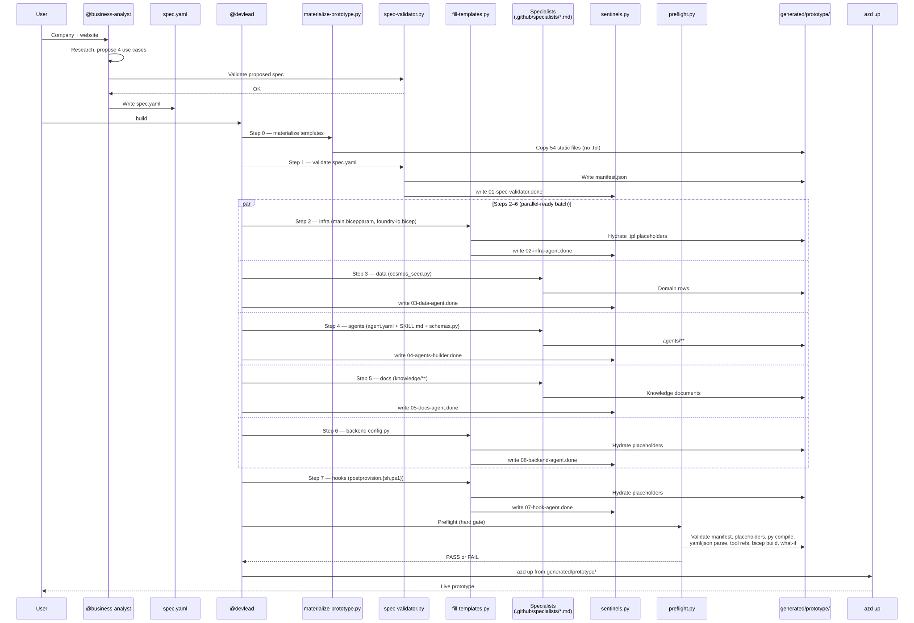
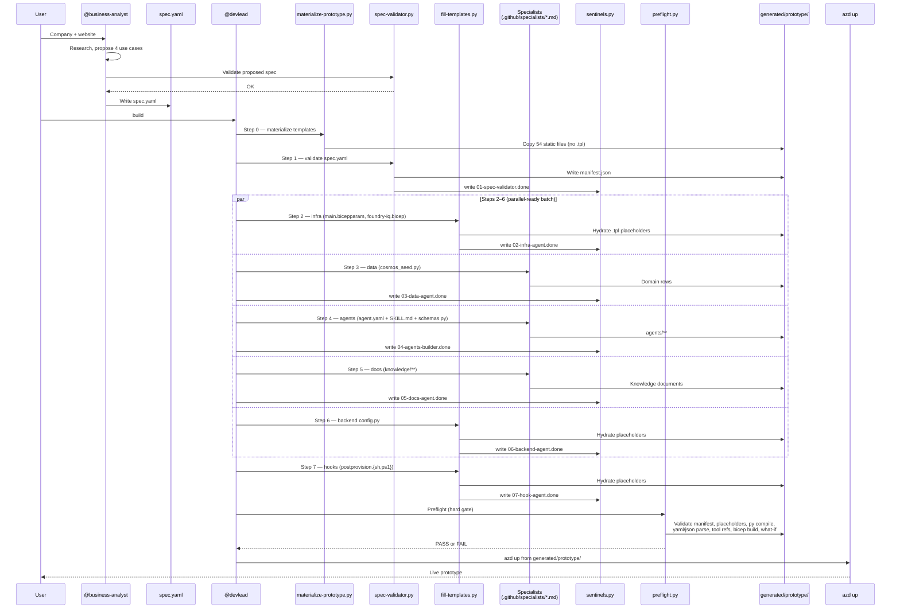
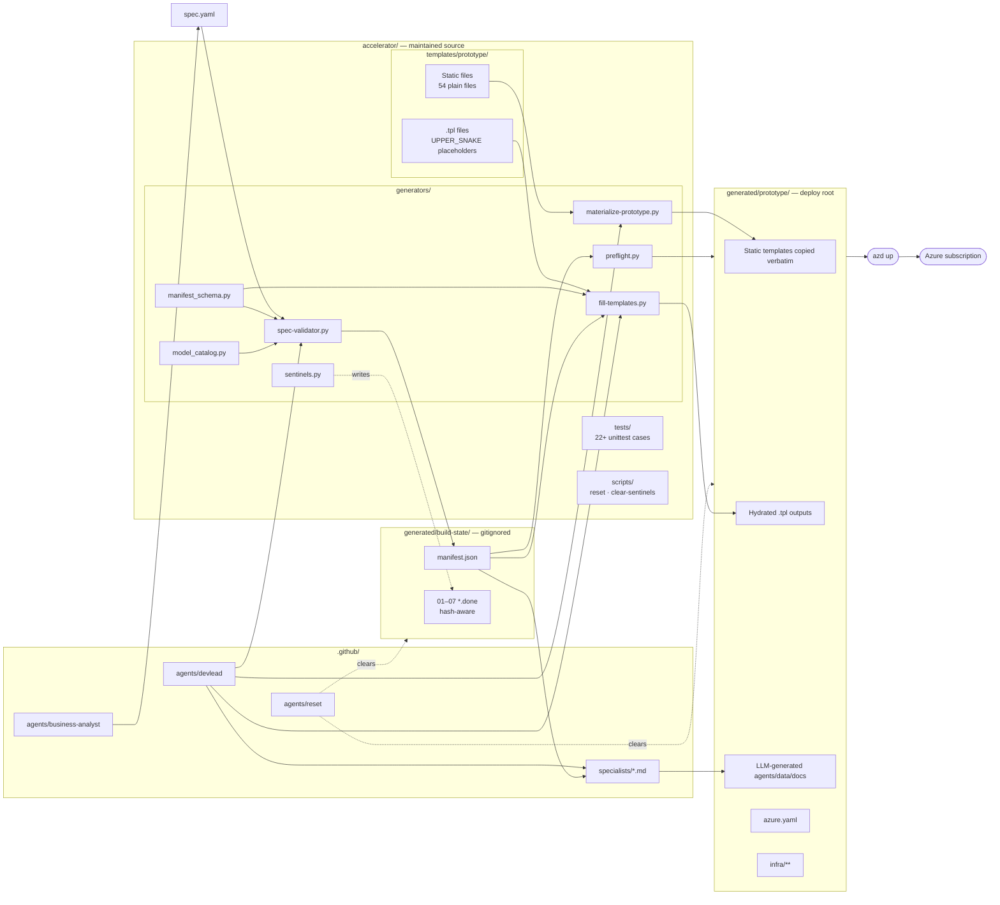

# Accelerator Architecture

How the `ai-prototype-accelerator` itself works — the pipeline that turns one `spec.yaml` into a fully provisioned, validated, deployable prototype under `generated/prototype/`.

For the architecture of the **produced prototype**, see [prototype-architecture.md](prototype-architecture.md). This document covers the **build system**.

> Diagrams are pre-rendered to SVG under [images/](images/) for reliable preview rendering. Mermaid source is kept in collapsible blocks below each image. To regenerate after editing, run:
>
> ```pwsh
> npx -y @mermaid-js/mermaid-cli -i <source.mmd> -o docs/images/<name>.svg --backgroundColor transparent
> ```

## Build pipeline (sequence)



<details>
<summary>Mermaid source</summary>



</details>

## Repository layout (flowchart)



<details>
<summary>Mermaid source</summary>



</details>

## The three layers of produced output

Every artifact under `generated/prototype/` falls into exactly one of three layers:

| Layer | Source | Who writes it | Mutability |
|---|---|---|---|
| **Static template** | `accelerator/templates/prototype/**` (no `.tpl`) | Accelerator maintainers only | Copied verbatim by `materialize-prototype.py`. Fix bugs at the template — never patch the generated file alone. |
| **`.tpl` + placeholders** | `accelerator/templates/prototype/**/*.tpl` | Maintainers (template) + `fill-templates.py` (hydration) | Placeholders are `{{UPPER_SNAKE_CASE}}`. Unresolved tokens = hard error. |
| **LLM-generated** | `.github/specialists/*.md` invoked by `@devlead` | Specialists at build time | Only genuinely creative content: agent personas, seed data, knowledge docs. Plumbing belongs in the layers above. |

## Quality gates

Each gate must pass — none can be bypassed.

| Gate | Implementation | What it enforces |
|---|---|---|
| **Manifest schema** | [`manifest_schema.py`](../accelerator/generators/manifest_schema.py) — invoked by `spec-validator.py` and `fill-templates.py` | Required fields, types, list-item shape, cross-field rule (every `agents[].model` resolves to a `modelDeployments[].deploymentName`) |
| **Unresolved placeholders** | [`fill-templates.py`](../accelerator/generators/fill-templates.py) | Any leftover `{{PLACEHOLDER}}` after hydration → exit 1 |
| **Hash-aware sentinels** | [`sentinels.py`](../accelerator/generators/sentinels.py) | Sentinels carry `specChecksum` + `outputHash`. Resume re-runs a step if either changed. |
| **Preflight** | [`preflight.py`](../accelerator/generators/preflight.py) | Required paths exist · manifest matches schema · no `{{PLACEHOLDER}}` left · every `.py` compiles · every `.yaml`/`.json` parses · agent tool refs resolve · `az bicep build` succeeds · `az deployment group what-if` passes (soft-skip if not logged in) |
| **Contract tests** | `py -3 -m unittest discover -s accelerator/tests` | 22+ unit tests for schema, model catalog, sentinels, tool definitions, end-to-end hydration |

## Resume & rebuild semantics

The build graph is **dependency-aware** and **idempotent**:

- **Fresh build** — `@devlead build` runs every step from scratch.
- **Resume** — `@devlead build resume` skips steps whose sentinel matches the current `specChecksum` + `outputHash`. Touch `spec.yaml` → invalidates step 1 → cascades to dependents.
- **Targeted rebuild** — `@devlead rebuild step 3` clears that step's sentinel (and any missing prerequisites), then re-runs only what's needed.
- **Reset** — `@reset` previews what will be cleared; `@reset confirm` wipes `generated/` while preserving `accelerator/`, `.github/`, and `spec.yaml`.

## Agents (orchestration layer)

The build is driven by three Markdown-defined agents under `.github/agents/`:

| Agent | Role |
|---|---|
| [`business-analyst`](../.github/agents/business-analyst.agent.md) | Researches a company, proposes 4 tailored AI use cases, writes & validates `spec.yaml` |
| [`devlead`](../.github/agents/devlead.agent.md) | Executes the build graph end-to-end: materialize → validate → parallel batch → hooks → preflight → `azd up` |
| [`reset`](../.github/agents/reset.agent.md) | Resets the produced prototype + build state without touching maintained source |

Each step in the graph delegates content generation to a **specialist** prompt under [`.github/specialists/`](../.github/specialists/), which devlead reads fresh on every invocation.

## Source-of-truth precedence

When in doubt during a build, consult in this order:

1. [`.github/architecture-reference.md`](../.github/architecture-reference.md) — canonical
2. `generated/build-state/manifest.json` — current build's resolved values
3. Generated artifacts under `generated/prototype/` — last-known produced state

Never treat files under `generated/` as long-term source-of-truth edits — they are rewritten on every `@devlead build`.
