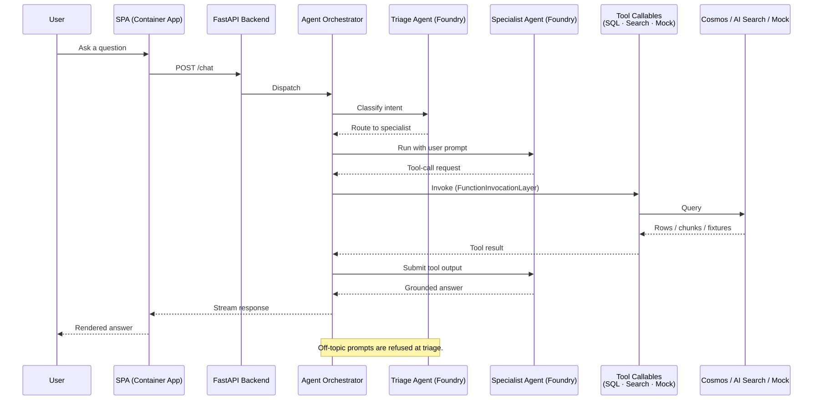
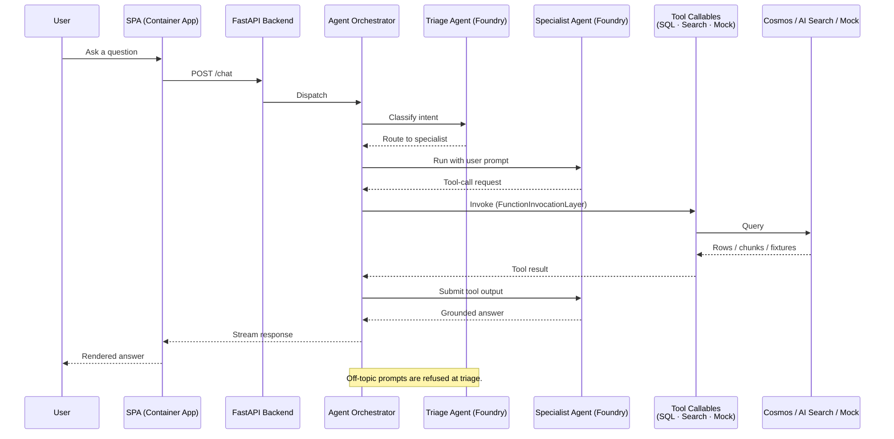
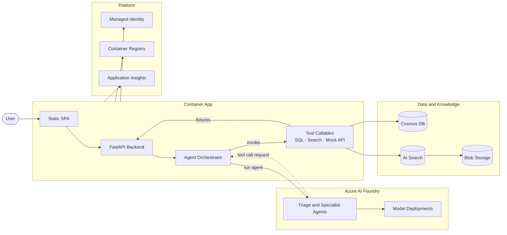

# Prototype Architecture

High-level flow of a deployed `ai-prototype-accelerator` instance.

## Design pattern: triage and specialists (router + experts)

Multi-agent chat assistants can be designed many ways — sequential pipelines, hierarchical planner-and-workers, peer-to-peer collaborative agents, plan-and-execute (ReAct), single monolithic agents with many tools, and so on. Each pattern trades off latency, predictability, reasoning depth, and operational complexity differently.

**This accelerator follows the *triage + specialists* pattern** (also called *router + experts* or *intent-based routing*):

- A single **triage agent** receives every user message, classifies intent in one short turn, and routes to exactly one **specialist agent**.
- Each **specialist** is a narrow, domain-scoped agent with its own instructions, knowledge, and tool list (SQL, AI Search, mock API).
- The orchestrator runs the selected specialist with per-user conversation history (`AgentSession`) until it produces a grounded answer.
- Off-topic or out-of-scope prompts are refused at triage, never reaching a specialist.

**Why this pattern for prototypes:**

- **Predictable cost and latency** — each turn is at most two agent calls (triage + one specialist), with no planner loops.
- **Bounded blast radius** — a specialist only sees the tools it needs, so tool-call surface is smaller and easier to evaluate.
- **Easy to extend** — adding a use case means adding one specialist + a routing keyword, with no changes to other agents.
- **Maps cleanly to evaluation** — each specialist can be evaluated against its own golden dataset in Foundry.

**Trade-offs (what this pattern is *not* good at):**

- Cross-domain questions that need two specialists working together — triage must pick one.
- Multi-step plans that span tools across specialists — needs a planner pattern instead.
- Open-ended research where the right specialist isn't knowable up front.

If your use case needs those, swap the orchestrator for a planner-and-workers or peer-to-peer pattern. The data plane, identity, and infrastructure layers stay the same.

---

> Diagrams are pre-rendered to SVG under [images/](images/) so the markdown preview displays them reliably even if the Mermaid preview extension misbehaves. The Mermaid source is kept in collapsible blocks below each image as the source of truth. To regenerate after editing, run:
>
> ```pwsh
> npx -y @mermaid-js/mermaid-cli -i <source.mmd> -o docs/images/<name>.svg --backgroundColor transparent
> ```

## Request flow (sequence)



<details>
<summary>Mermaid source</summary>



</details>

## Component layout (flowchart)



<details>
<summary>Mermaid source</summary>



</details>
